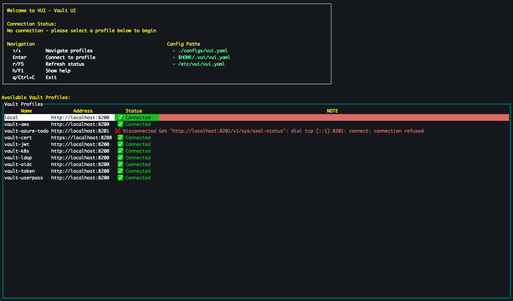

# VUI (Vault UI)

A Console User Interface (CUI) application for HashiCorp Vault.



## Overview

VUI provides an intuitive terminal-based interface for exploring and managing secrets in HashiCorp Vault. The application supports multiple vault connections, hierarchical secret navigation, and full CRUD operations.

## Usage

### Vault Profiles Screen

When no vault servers are connected, you'll see:

- **Welcome message** with connection status
- **Navigation instructions** and keyboard shortcuts
- **List of configured vault profiles** with their connection status:
  - ✅ **Connected**: Vault is reachable and unsealed
  - 🔒 **Sealed**: Vault is reachable but sealed
  - ❌ **Disconnected**: Vault is not reachable

### Keyboard Shortcuts

#### Navigation
- `↑/↓`: Navigate tree items
- `←/→`: Collapse/expand tree nodes
- `Enter`: Select item or enter directory
- `Esc`: Go back or cancel
- `Tab`: Navigate form fields (in forms)

#### Secret Panel
- `c`: Create new secret
- `e`: Edit selected secret
- `Ctrl+d`: Delete selected secret
- `d`: Unmask/mask secret value
- `v`: Copy secret value to clipboard

#### Vault Management
- `Tab`: Switch vault profiles (shows profiles table)
- `Esc`: Go back to secrets (if previously selected a profile)

#### Global
- `h/F1`: Show help
- `r/F5`: Refresh
- `q/Ctrl+C`: Exit application

## Configuration

VUI uses YAML configuration files with environment variable support.

### Default Configuration

The application looks for configuration in:
1. `./configs/vui.yaml`
2. `$HOME/.vui/vui.yaml`
3. `/etc/vui/vui.yaml`

### Example Configuration

```yaml
app:
  log_level: "info"
  log_file: "vui.log"

ui:
  theme: "dark"
  show_hidden_secrets: false

profiles:
  local:
    address: "http://localhost:8200"
    auth_method: "token"
    token: "${VAULT_TOKEN}" # variable will be read from environment variables once app is started
    namespace: ""
```

For complete example, see [vui.yaml](./configs/vui.yaml)

### Advanced Authentication Examples

#### LDAP Authentication
```yaml
profiles:
  ldap_vault:
    engine: vault
    address: "https://vault.company.com"
    auth_method: "ldap"
    namespace: "production"
    auth_config:
      username: "${VAULT_USERNAME}"
      password: "${VAULT_PASSWORD}"
```

#### AWS IAM Authentication
```yaml
profiles:
  aws_vault:
    address: "https://vault.company.com"
    auth_method: "aws"
    namespace: "aws"
    auth_config:
      aws_access_key_id: "${AWS_ACCESS_KEY_ID}"
      aws_secret_access_key: "${AWS_SECRET_ACCESS_KEY}"
      aws_role: "vault-role"
      aws_region: "us-east-1"
```

#### Kubernetes Authentication
```yaml
profiles:
  k8s_vault:
    address: "https://vault.company.com"
    auth_method: "kubernetes"
    namespace: "k8s"
    auth_config:
      k8s_role: "vault-role"
      k8s_token_path: "/var/run/secrets/kubernetes.io/serviceaccount/token"
```

#### JWT Authentication
```yaml
profiles:
  jwt_vault:
    address: "https://vault.company.com"
    auth_method: "jwt"
    namespace: "jwt"
    auth_config:
      jwt_role: "vault-role"
      jwt: "${JWT_TOKEN}"
```

#### Certificate Authentication
```yaml
profiles:
  cert_vault:
    address: "https://vault.company.com"
    auth_method: "cert"
    namespace: "cert"
    auth_config:
      cert_name: "vault-client"
      cert_path: "/path/to/client.crt"
      key_path: "/path/to/client.key"
```

#### AWS SecretsManager

```yaml
profiles:
  aws_secretsmanager:
    engine: aws/secretsmanager
    auth_method: "aws"
    auth_config:
      aws_access_key_id: "${AWS_ACCESS_KEY_ID}"
      aws_secret_access_key: "${AWS_SECRET_ACCESS_KEY}"
      aws_session_token: "${AWS_SESSION_TOKEN}"
      aws_region: "us-east-1"
```

#### AWS SSM Parameters

```yaml
profiles:
  aws_ssm:
    engine: aws/ssm
    auth_method: "aws"
    auth_config:
      aws_access_key_id: "${AWS_ACCESS_KEY_ID}"
      aws_secret_access_key: "${AWS_SECRET_ACCESS_KEY}"
      aws_session_token: "${AWS_SESSION_TOKEN}"
      aws_region: "us-east-1"
```

## Installation

### Download from Release

[https://github.com/rvolykh/vui/releases](https://github.com/rvolykh/vui/releases)

### Build from Source

Prerequisites:
- Go 1.21 or later

Steps:
```bash
# Clone the repository
git clone https://github.com/rvolykh/vui.git
cd vui

# Build the application
make build

# Run the application
./vui
```

## Development

### Available Make Targets

```text
Usage:
  make <target>

Build targets
  deps                  Download and tidy dependencies
  fmt                   Format source code
  vet                   Examine source code
  build                 Build the application

Test targets
  test                  Run tests, e.g. make test, make test TestCoalesce
  coverage              Run tests with coverage

Sandbox targets
  sbx-build             Build sandbox init image(s)
  sbx-up                Create sandbox, e.g. make sbx-up, make sbx-up vault
  sbx-logs              Show logs for sandbox, e.g. make sbx-logs, make sbx-logs vault
  sbx-ps                Show sandbox services
  sbx-run               Run vui in sandbox
  sbx-down              Destroy sandbox

Other targets
  clean                 Clean temporary files
  help                  Show help message
```

### Sandbox

Local playground environment with different vault auths / profiles.

Refer to [Sandbox](./sandbox/README.md) for more details.

### 🔧 Dependencies

- **Vault API**: `github.com/hashicorp/vault/api` - Official HashiCorp Vault client
- **Configuration**: `github.com/spf13/viper` - Configuration management
- **Terminal UI**: `github.com/rivo/tview` - Terminal user interface framework
- **Terminal Control**: `github.com/gdamore/tcell/v2` - Terminal control library
- **Clipboard**: `github.com/atotto/clipboard` - Cross-platform clipboard access
- **Logging**: `github.com/sirupsen/logrus` - Structured logging
- **Testing**: `github.com/stretchr/testify` - Test assertions

## Acknowledgments

- Inspired by [derailed/k9s](https://github.com/derailed/k9s) for Kubernetes management
- Built with [HashiCorp Vault](https://www.vaultproject.io/) API
- Uses [tview](https://github.com/rivo/tview) and [tcell](https://github.com/gdamore/tcell) for terminal UI
